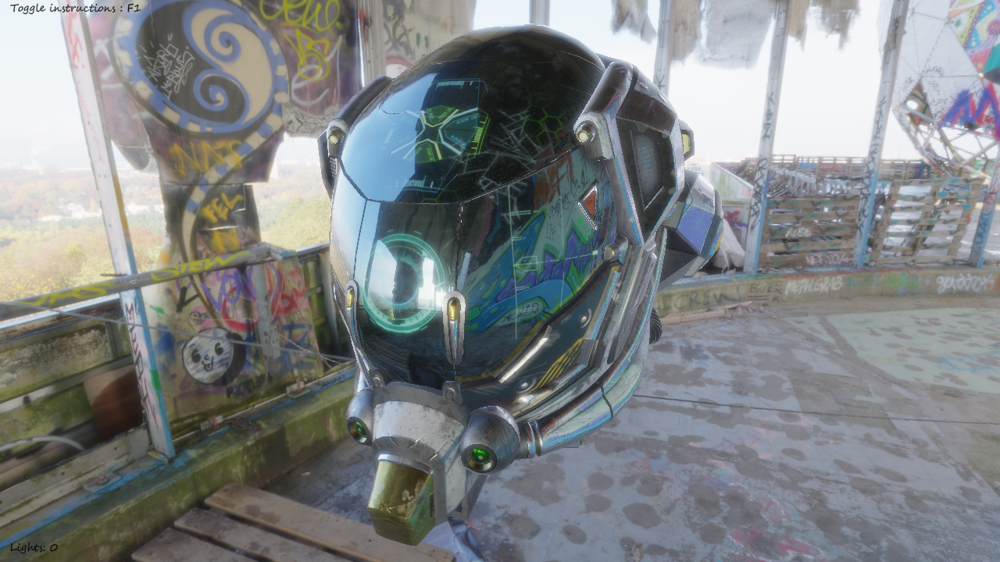

# baGL

baGL is an OpenGL framework that I use for educational purpose. It uses [LWJGL 3](https://www.lwjgl.org/) and [JOML](https://github.com/JOML-CI/JOML).

## Features

- Deferred Rendering
- Physically Based Rendering. See [Epic's paper](http://blog.selfshadow.com/publications/s2013-shading-course/karis/s2013_pbs_epic_notes_v2.pdf)
- IBL
- Cascaded Shadow Mapping
- Post processing (bloom, gamma correction and tone mapping, anti aliasing)
- Lights (directional lights, point lights and spot lights)
- HDR environment maps (from .hdr equirectangular images)
- Partial [glTF 2.0](https://github.com/KhronosGroup/glTF) support
- 3D Particles using Geometry Shader
- Sprite batching
- Scalable text using Signed Distance Field fonts. See [Valve's paper](http://www.valvesoftware.com/publications/2007/SIGGRAPH2007_AlphaTestedMagnification.pdf)
- Simple scene graph
- Shader #import directive
- Basic assets management
- Transform based model animations
- Mesh skinning

## Modules

This project is separated in several modules :

- The `core` module which contains low level code for the project
- The `opengl` module which contains OpenGL wrappers and utilities
- The `engine` module which contains the main loop, window and inputs management, the scene graph and more
- The `deferred` module which contains a pbr deferred scene renderer
- The `tests` module which contains utility for unit tests

## TODO

- Rendering
    - Sprites in 3D environment (debug icons, ...)
    - Area lights (sphere and tubes)
    - UI (third party ?)
- OpenGL state manager
- Complete glTF 2.0 support
- An overall review, some refactoring and code cleanup
- And much more... :)

## References

- [Learn OpenGL.com](https://learnopengl.com/)
- [ThinMatrix's](https://www.youtube.com/user/ThinMatrix) youtube channel
- [Epic's paper](http://blog.selfshadow.com/publications/s2013-shading-course/karis/s2013_pbs_epic_notes_v2.pdf) about their PBR implementation
- [Valve's paper](http://www.valvesoftware.com/publications/2007/SIGGRAPH2007_AlphaTestedMagnification.pdf) on SDF font rendering
- [OpenGL reference pages](https://www.khronos.org/registry/OpenGL-Refpages/gl4/)
- [Wikipedia](https://www.wikipedia.org/)
- [NVidia's FXAA's paper](https://developer.download.nvidia.com/assets/gamedev/files/sdk/11/FXAA_WhitePaper.pdf) and [FXAA 3.11 source code](https://gist.github.com/kosua20/0c506b81b3812ac900048059d2383126)
- [GPU Gems 3](https://developer.nvidia.com/gpugems/GPUGems3/gpugems3_ch10.html), [Microsoft Docs](https://docs.microsoft.com/en-us/windows/desktop/dxtecharts/cascaded-shadow-maps) for Cascaded Shadow Mapping.
- [This gamedev.net](https://www.gamedev.net/forums/topic/591684-xna-40---shimmering-shadow-maps/) post about stabilizing shadow maps.